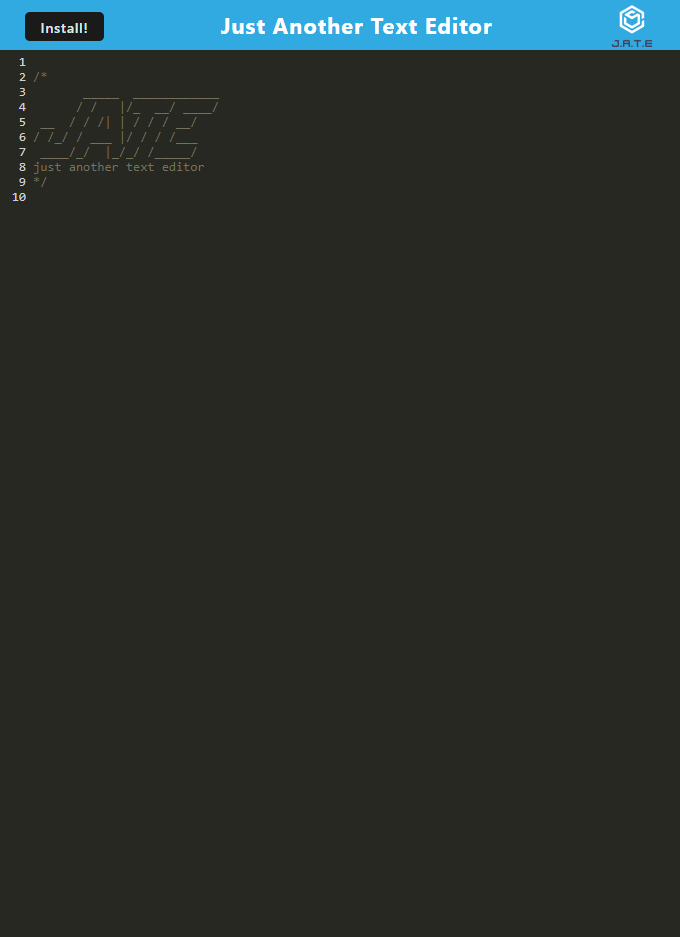

# Text Editor

## Description

This application provides a free text editor: either as an installable application, or within your browser window. This code has been modified to act as a progressive web application, or PWA.

## Table of Contents 

- [Installation](#installation)

- [Usage](#usage)

- [License](#license)

- [Contributing](#contributing)

- [Tests](#tests)

- [Questions](#questions)

## Installation

Before running the application, make sure you have installed the packages listed in the package.json file. Navigate to the repository in the terminal and run 'npm i' to install. Then, execute "npm run start", and open the application at the specified port. Click on the "Install" button on the resulting page to download the application to your local device. 

## Usage

After running the application with "npm run start", the user is directed to localhost port 3000, and the "JATE" window displayed. Here, users can write text in the text entry fields present on the screen. By clicking the "Install!" button, users can download a copy of the application to use outside of their browser. 

## License

This project is covered under the MIT license.

## Contributing

N/A

## Tests

N/A

## Questions

Github Profile: https://github.com/agarfar

Please address all questions regarding this project to the following email: antfar67@gmail.com
